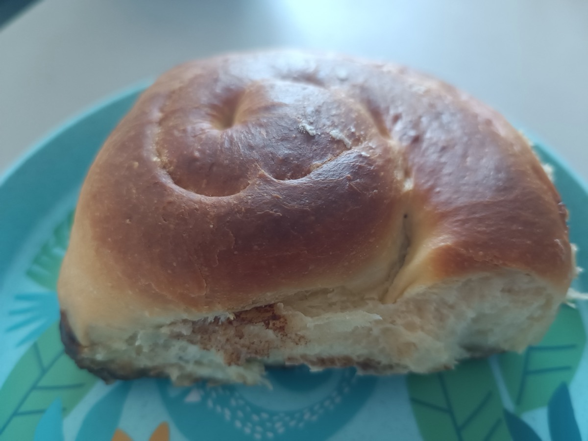
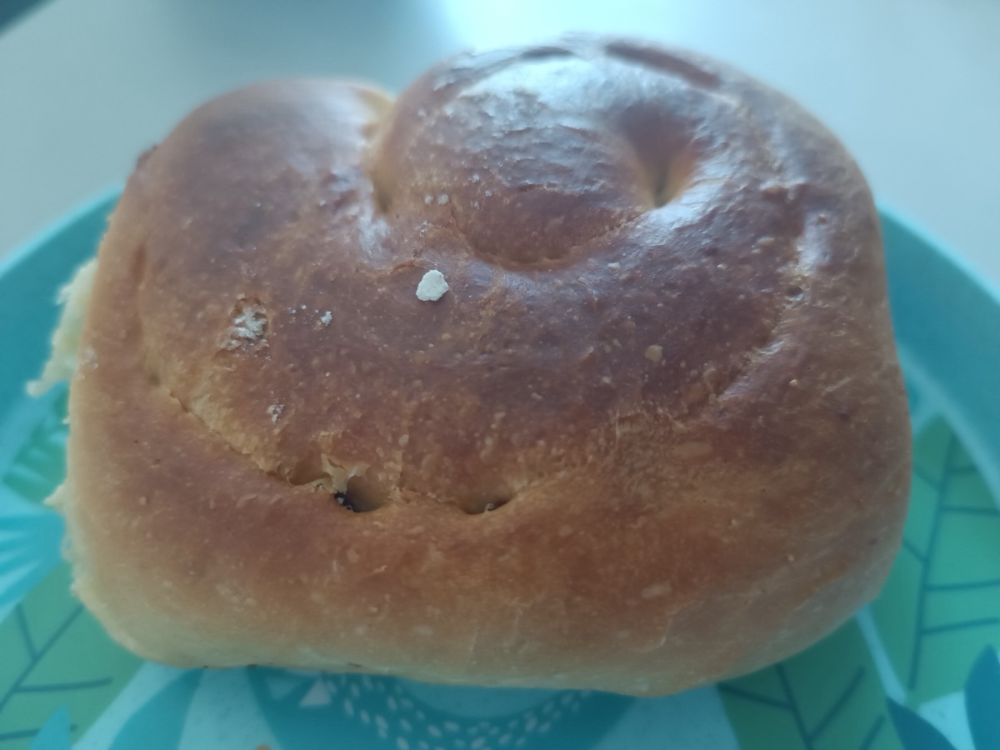
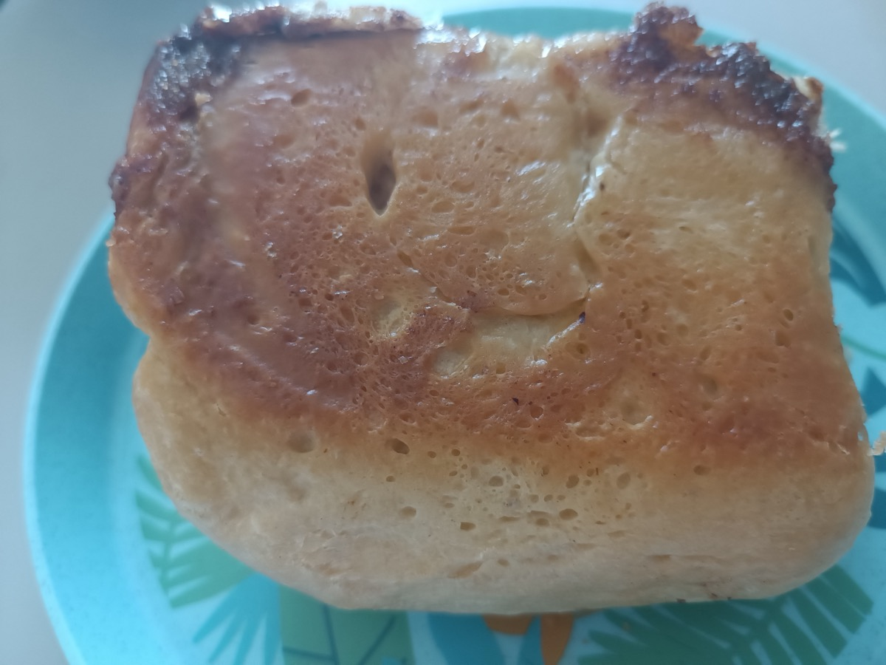

# Schokoschnecken - Kombi: Hefeteig + Schokotröpfchen statt Zimt-Füllung

**Portionen:** 12 Schnecken bei Faktor 1
**Kategorie:** Backen
**Enthält keine Nüsse.**

Einmal gebacken: eine Schnecke aus dem Probebacken-Teig (Faktor 0,5), siehe
Fotos unten. Teig und Füllung haben funktioniert, der Boden wurde zu dunkel.

## Bestandteile

- Teig: [`hefeteig-grundrezept.md`](hefeteig-grundrezept.md) - Variante **normal**
  (laktosefrei geht genauso)
- Füllung: [`fuellung-schokotropfen.md`](fuellung-schokotropfen.md)
- Topping: keins nötig. Optional gesiebter Puderzucker, oder
  [`sauce-frischkaese-frosting.md`](sauce-frischkaese-frosting.md)

Zubereitung: [`hefeteig-grundrezept.md`](hefeteig-grundrezept.md) Schritt 1-6,
Füllung wird in Schritt 3 aufgetragen. Eng in eine Form mit Backpapier setzen,
nicht mit Abstand aufs Blech.

## Skalierung

Faktor-Tabellen stehen in [`hefeteig-grundrezept.md`](hefeteig-grundrezept.md)
und [`fuellung-schokotropfen.md`](fuellung-schokotropfen.md).

## Erster Versuch (Fotos und Befund)

Teig wie im Probebacken (erste Gehzeit etwa 9 h über Nacht bei Raumtemperatur,
danach gefaltet und geknetet, zweite Gehzeit etwa 1,5 h; Teig mit der
Backpulver-Option), eine Schnecke, Füllung ca. 25 g Schokotröpfchen.

**Oben:** kräftig aufgegangen, gleichmäßig goldbraun mit Glanz, Spirale
sichtbar, an der Bruchstelle weiche, feine Krume - so soll ein Hefeteig mit
80 g Butter auf 500 g Mehl aussehen.

**Unten:** deutlich dunkler, an den Rändern fast schwarz karamellisiert,
Unterseite leicht feucht - ausgelaufene Butter aus dem Teig und geschmolzene
Tröpfchen sind am Boden verbrannt.

**Beim nächsten Versuch:** Backpapier in die Form, mittlere Schiene; wird der
Boden trotzdem zu dunkel, die Form für die letzten 5-8 Minuten auf ein zweites
Blech stellen. Über Nacht besser im Kühlschrank.

## Notizen

- Fehlt eine Zutat? Siehe [`../substitution.md`](../substitution.md)
- Verwandt: [`zimtschnecken.md`](zimtschnecken.md) - gleicher Teig, andere Füllung;
  Probebacken mit Fotos der Zimtschnecken:
  [`zimtschnecken-pudding-cheesecake-frosting-6.md`](zimtschnecken-pudding-cheesecake-frosting-6.md)
