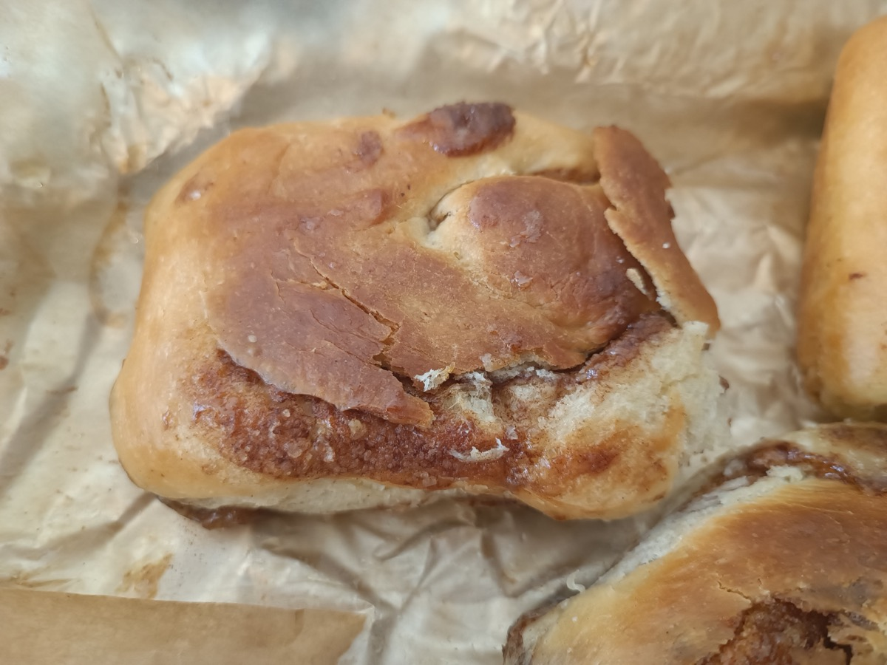
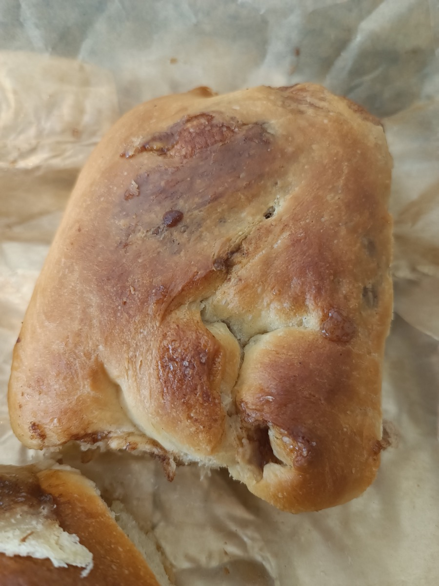
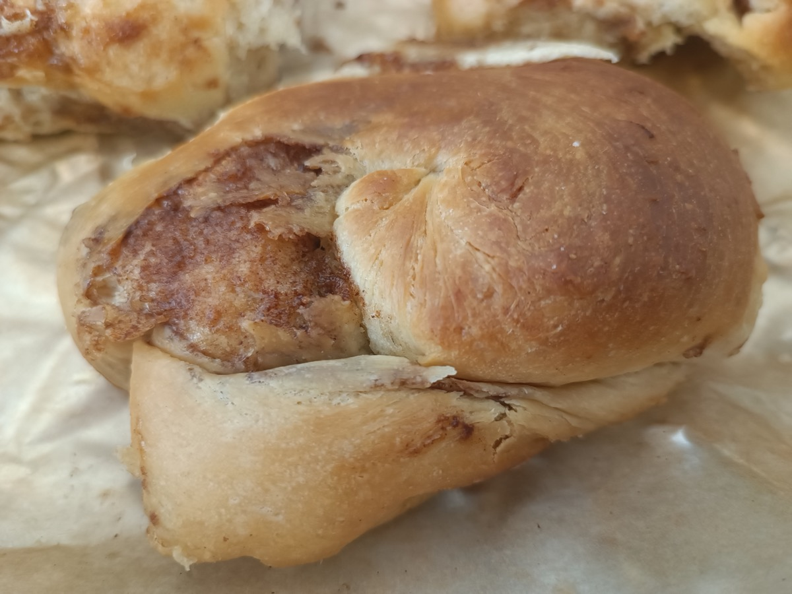
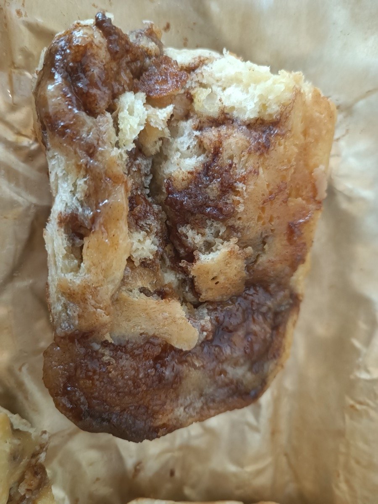
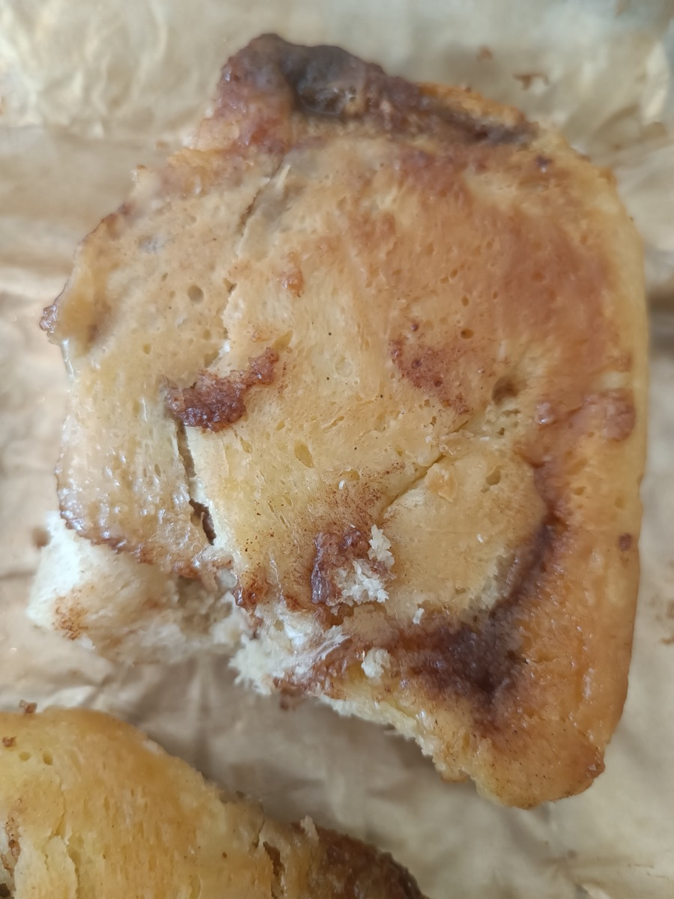
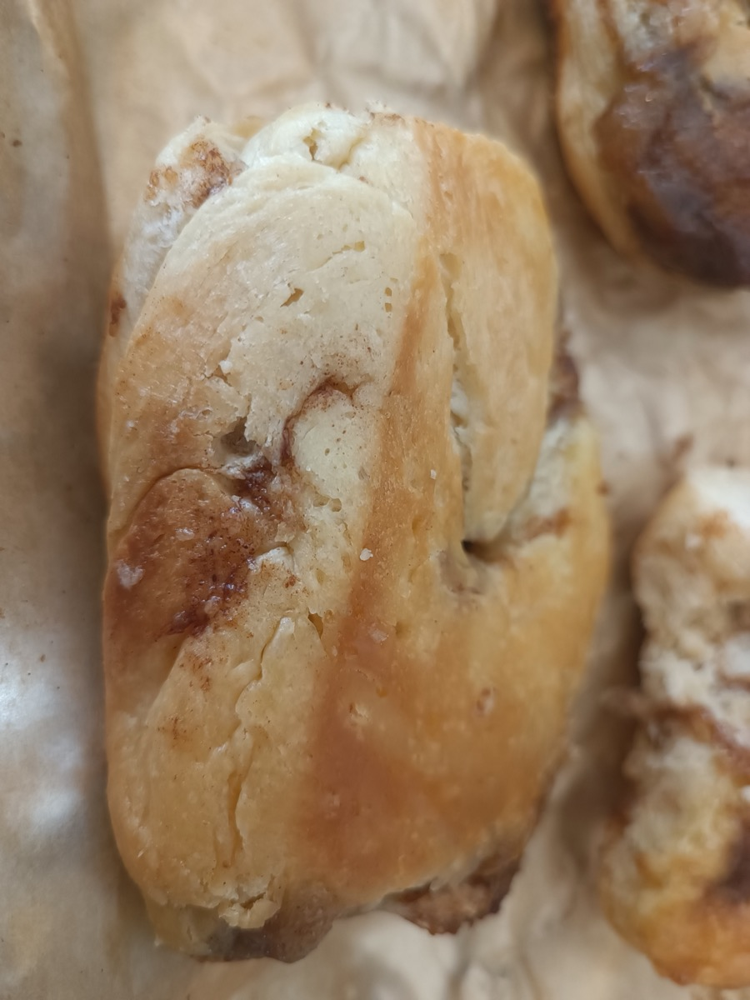

# Zimtschnecken mit Pudding-Cheesecake-Frosting, 6 Stück (Probebacken, UNGETESTET)

**Portionen:** 6 Schnecken
**Zeit:** ca. 2,5 h, davon 1,5 h Warten (Pudding kühlt, Teig geht)
**Kategorie:** Backen
**Enthält keine Nüsse.** Enthält Gluten, Ei, Milch.

Komplett ausgeschrieben, Faktor 0,5 der Kombi
[`zimtschnecken-mit-puddingcreme-frischkaese-frosting.md`](zimtschnecken-mit-puddingcreme-frischkaese-frosting.md).
Bewusst eine Kopie: zum Backen soll man nicht blättern müssen. Ändert sich ein
Teil-Rezept, hier nachziehen.
Abweichung von der Kombi: brauner statt weißer Zucker im Teig (Karamellnote,
sonst ohne Wirkung); Pudding und Frosting unverändert.

## Gesamtmengen (Einkauf)

Alles zusammengerechnet über Puddingcreme, Teig, Füllung und Frosting.

| Zutat | gesamt | Hinweis |
|---|---|---|
| Weizenmehl Type 405 | 250 g |  |
| Milch (ml) | 375 ml |  |
| Butter | 120 g | plus etwas für die Form, also ein halbes 250-g-Päckchen |
| Zucker | 30 g | nur für die Puddingcreme |
| Brauner Zucker | 85 g | Teig und Füllung |
| Puderzucker | 55 g | 50-60 g, je nach Süße |
| Frischkäse Doppelrahm | 75 g |  |
| Ei (Stück) | 0,5 | 1 Ei verquirlen, die Hälfte nehmen |
| Eigelb (Stück) | 1 | vom zweiten Ei, insgesamt also 2 Eier |
| Trockenhefe | 3,5 g | ein halbes Päckchen |
| Speisestärke | 15 g |  |
| Vanillezucker (Päckchen) | 0,5 | ca. 4 g |
| Zimt (TL) | 1,25 | ca. 3 g |
| Salz | 1,5 g | ca. 1/4 TL, plus 1 Prise für die Puddingcreme |

## Zutaten

**Puddingcreme** (halbe Menge, es wird nur ein Teil gebraucht, Rest ist Dessert)
- 250 ml Milch
- 15 g Speisestärke
- 30 g Zucker
- 1 Prise Salz
- 1 Eigelb
- 1/2 Päckchen Vanillezucker (ca. 4 g)

**Hefeteig**
- 250 g Weizenmehl Type 405
- 3,5 g Trockenhefe (1/2 Päckchen)
- 125 ml Milch, lauwarm
- 35 g brauner Zucker
- 40 g Butter, weich
- 1/4 TL Salz (ca. 1,5 g)
- 1/2 Ei: 1 Ei verquirlen, davon ca. 2 EL (27 g) nehmen

**Zimt-Füllung**
- 50 g Butter, sehr weich
- 50 g brauner Zucker
- 1 1/4 TL gemahlener Zimt (ca. 3 g)

**Frosting**
- 75 g Frischkäse, Doppelrahmstufe, kalt
- 30 g Butter, weich
- 50-60 g Puderzucker (weniger als üblich, die Puddingcreme süßt mit)
- 40-80 g kalte Puddingcreme von oben, Ziel 60 g (ca. 3 EL, 1 EL ≈ 20 g)

**Außerdem:** etwas Butter für die Form. Insgesamt 2 Eier (eines für den Teig,
vom anderen das Eigelb).

## Zubereitung

**A. Puddingcreme (zuerst, sie muss ganz kalt werden)**

1. Speisestärke, Zucker, Vanillezucker, Salz und Eigelb mit 3-4 EL der kalten Milch glatt rühren. Nie Stärke direkt in heiße Milch, sonst Klümpchen.
2. Restliche Milch in einem kleinen Topf aufkochen. Topf vom Herd, die Stärkemischung einrühren.
3. Zurück auf den Herd, unter ständigem Rühren kurz aufkochen lassen, bis die Masse deutlich andickt (ca. 1 Minute).
4. In eine Schüssel füllen, Frischhaltefolie direkt auf die Oberfläche legen (sonst Haut), abkühlen lassen, dann in den Kühlschrank. Braucht 1-1,5 h bis kalt.

**B. Hefeteig**

5. Mehl, Trockenhefe, Zucker und Salz in einer Schüssel mischen.
6. Lauwarme Milch (handwarm, nicht heiß, sonst stirbt die Hefe), das halbe Ei und die weiche Butter dazu. Mit Knethaken oder von Hand 5-8 Minuten zu einem glatten, geschmeidigen Teig kneten. Er darf leicht kleben, aber nicht schmieren.
7. Schüssel abdecken, an einem warmen Ort 45-60 Minuten gehen lassen, bis sich das Volumen etwa verdoppelt hat.

**C. Füllung (während der Teig geht)**

8. Weiche Butter, braunen Zucker und Zimt mit einer Gabel zu einer streichfähigen Paste verrühren. Beiseite stellen, nicht kühlen.

**D. Formen und backen**

9. Eine kleine Auflaufform oder 20-cm-Springform mit Butter fetten.
10. Teig auf leicht bemehlter Fläche zu einem Rechteck von ca. 25 × 40 cm ausrollen.
11. Zimt-Paste gleichmäßig auf dem Teig verstreichen, an einer der kurzen Seiten 2 cm Rand frei lassen.
12. Von der gegenüberliegenden kurzen Seite (25 cm) her eng aufrollen, die Naht am freien Rand festdrücken. Die Rolle ist ca. 25 cm lang.
13. Mit einem scharfen Messer oder einem Stück Zahnseide in 6 Scheiben à ca. 4 cm schneiden.
14. Scheiben mit der Schnittfläche nach oben in die Form setzen, mit etwas Abstand. Abdecken, 20 Minuten ruhen lassen.
15. Währenddessen Backofen auf 180 °C Ober-/Unterhitze vorheizen.
16. 20-25 Minuten backen, bis die Oberfläche goldbraun ist. Aus dem Ofen nehmen, in der Form 10 Minuten stehen lassen, dann herausnehmen und auf einem Gitter abkühlen lassen. Das Frosting kommt erst auf ausgekühlte oder höchstens lauwarme Schnecken.

**E. Frosting (wenn die Schnecken abgekühlt sind)**

17. Weiche Butter und Puderzucker mit dem Handrührgerät 2-3 Minuten hell und cremig schlagen.
18. Kalten Frischkäse dazu, nur kurz unterrühren, etwa 10-20 Sekunden. Länger gerührt wird Frischkäse flüssig.
19. Kalte Puddingcreme in Portionen unterrühren: erst 40 g, kurz rühren, Konsistenz und Süße prüfen, dann bis 60 g. Ziel: streichfähig, nicht fließend. Über 80 g nicht, sonst läuft es von den Schnecken.
20. Frosting auf die Schnecken streichen. Rest der Puddingcreme als Dessert.

## Worauf achten (weil ungetestet)

- Wenn das Frosting nach dem Puddingcreme-Zugeben zu weich wird: 15 Minuten kühlen, dann streichen.
- Wenn die Schnecken innen noch teigig wirken: 3-5 Minuten länger backen, oben mit Alufolie abdecken, falls sie zu dunkel werden.
- Notieren, wie viel Gramm Puddingcreme es waren und wie süß es war - das ist die eine Zahl, die der Kombi noch fehlt.

## Erster Versuch (Fotos und Befund)

Aus dem Teig wurden drei Zimtschnecken und eine Schokoschnecke (Füllung nur
Schokotröpfchen, sonst nichts). Ablauf abweichend vom Rezept: erste Gehzeit
etwa 9 h über Nacht, dann ausrollen, füllen, rollen, schneiden, zweite Gehzeit
etwa 1,5 h, gebacken auf Backpapier mit Abstand. Puddingcreme und Frosting
haben funktioniert.

Noch offen: über Nacht im Kühlschrank oder bei Raumtemperatur; Gramm
Schokotröpfchen; Gramm Puddingcreme im Frosting.

**Schokoschnecke:** Teig stimmt, Boden zu dunkel - Fotos und Befund in
[`schokoschnecken.md`](schokoschnecken.md).

**Zimtschnecken, oben** - die Außenlagen haben sich an den Nähten gelöst, die
Zimtschicht liegt frei, die Schnecken sind in die Breite statt in die Höhe
gegangen. Krume an den Bruchstellen weich und luftig, der Teig ist nicht das
Problem.

**Zimtschnecken, unten** - blass und sirupgetränkt statt gebräunt, Butter-Zucker
ist nach unten ausgelaufen und auf dem Papier karamellisiert.

**Ursachen** - Technik, nicht Mengen:
1. Auf dem Blech mit Abstand statt eng in einer Form: ohne Wand und Nachbarn
   läuft die Füllung unten raus, und nichts hält die Spirale zusammen.
2. Naht nicht festgedrückt oder nach außen gesetzt: die Außenlage springt beim
   Aufgehen auf.
3. 1,5 h zweites Gehen bei Raumtemperatur: die Butter-Zucker-Paste wird weich
   bis flüssig, der Teig verliert Spannung.

**Beim nächsten Versuch, eine Änderung nach der anderen:**
- Springform oder Auflaufform mit Backpapier, Schnecken eng aneinander. Der
  Sirup bleibt dann unter den Schnecken und zieht ein - das ist der gewollte
  klebrige Boden.
- Naht mit dem Daumen festdrücken, Schnecke mit der Naht zum Nachbarn setzen.
- Geformte Schnecken vor dem Backen 10-15 Minuten in den Kühlschrank, damit die
  Füllung fest ist, wenn der Teig im Ofen setzt.
- Erst wenn das nicht reicht: Füllung mit 80 g statt 100 g Butter, oder 1 TL
  Speisestärke in die Paste.

## Notizen

- Fehlt eine Zutat? Siehe [`../substitution.md`](../substitution.md)
